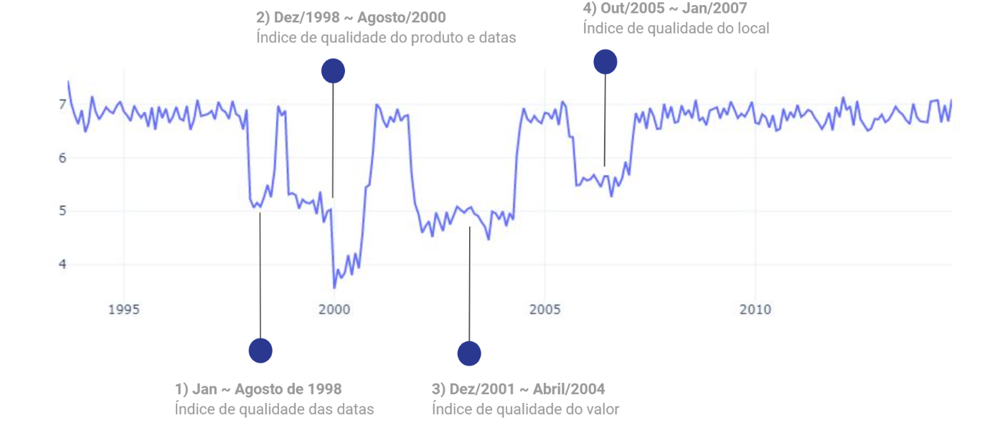

# Análise de Qualidade de dados

### Sobre:
> Análise desenvolvida para a aula de Governança de Dados do MBA em Big Data (Data Science) da Faculdade FIAP, com objetivo de descrever e identificar os problemas de dados existentes na amostra de dados fornecida.

  

